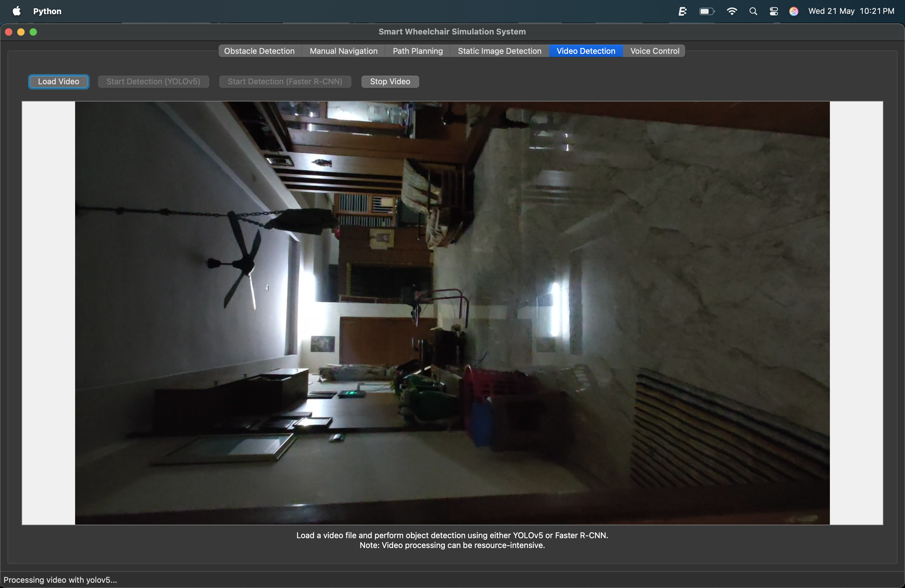
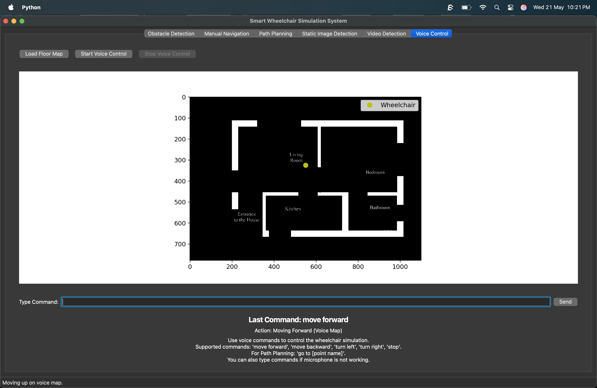

# Smart Wheelchair Simulation System

## Overview
The Smart Wheelchair Simulation System is a robust application designed to simulate the functionalities of an intelligent wheelchair. It integrates various computer vision and AI capabilities, including real-time obstacle detection, manual and autonomous navigation (path planning), object detection in static images and videos, and voice control for intuitive interaction. This system serves as a powerful demonstration and development platform for smart mobility solutions.

## Features

### 1. Obstacle Detection (Real-time Camera Feed)
* **Description:** This feature utilizes the YOLOv5 object detection model to identify obstacles in real-time using your computer's webcam feed. It processes frames, draws bounding boxes around detected obstacles, and provides real-time movement commands (`move_forward`, `move_left`, `move_right`, `stop`) based on obstacle proximity and location within the frame.
* **Technology:** YOLOv5, OpenCV.


### 2. Manual Navigation
* **Description:** Allows users to load a floor map image and manually control a simulated wheelchair (represented by a red dot) using directional buttons. The system prevents movement into obstacles or walls defined on the map.
* **Technology:** Matplotlib, NumPy.


### 3. Path Planning (A* Algorithm with Obstacle Buffering and Turn Penalty)
* **Description:** Enables autonomous navigation on a loaded floor map. Users can mark multiple points on the map, name them, and then select start and end points for path calculation.
    * **A* Algorithm:** Employs the A* pathfinding algorithm to find the shortest path between two points while avoiding obstacles.
    * **Obstacle Buffering:** Allows setting a buffer size around obstacles, ensuring the planned path maintains a safe distance from walls and detected hazards.
    * **Turn Penalty:** The A* algorithm is configured to penalize sharp turns, encouraging smoother and more natural-looking paths for the wheelchair.
    * **Animated Movement:** Visualizes the wheelchair's movement along the calculated path with an animated yellow dot.
* **Technology:** A* Search Algorithm, OpenCV (for dilation), Matplotlib, NumPy.


### 4. Static Image Detection
* **Description:** Provides the capability to load a static image file and perform object detection using either YOLOv5 or Faster R-CNN models. Detected objects are highlighted with bounding boxes and labels on the displayed image.
* **Technology:** YOLOv5, Faster R-CNN (ResNet50 FPN), OpenCV, PIL (Pillow).


### 5. Video Detection
* **Description:** Allows users to load a video file and perform real-time object detection on its frames using either YOLOv5 or Faster R-CNN. The processed video, with detected objects highlighted, is displayed within the application.
* **Technology:** YOLOv5, Faster R-CNN (MobileNetV3 FPN), OpenCV.



### 6. Voice Control
* **Description:** Offers an intuitive way to control the wheelchair simulation using voice commands.
    * **Speech Recognition:** Utilizes Google Speech Recognition to convert spoken commands into actions.
    * **Map Interaction:** Load a dedicated floor map within this tab, and voice commands like "move forward," "move backward," "turn left," "turn right," and "stop" will control a simulated wheelchair dot on this map.
    * **Continuous Movement:** When a movement command is given (e.g., "move forward"), the wheelchair will continue moving in that direction until a "stop" command or a turning command is issued, or an obstacle is hit.
    * **Path Planning via Voice:** In the "Path Planning" tab, you can use the command "go to [point name]" to initiate pathfinding to a pre-named location.
    * **Text Command Alternative:** Includes a text input field for typing commands, providing an alternative control method if microphone recognition is challenging.
* **Technology:** SpeechRecognition library, Matplotlib, NumPy, Regular Expressions.



## Setup and Installation

To run this application, you need Python and the specified libraries.

1.  **Prerequisites:**
    * Python 3.x (recommended 3.8+)
    * `pip` (Python package installer)

2.  **Clone or Download the Code:**
    Since this code was provided in a Canvas environment, you'll need to copy the Python code and save it as a `.py` file (e.g., `smart_wheelchair_app.py`).

3.  **Create `requirements.txt`:**
    Create a file named `requirements.txt` in the same directory as your Python script and paste the following content into it:

    ```
    opencv-python
    torch
    numpy
    matplotlib
    Pillow
    speechrecognition
    PyQt5
    torchvision
    ```

4.  **Install Dependencies:**
    Open your terminal or command prompt, navigate to the directory where you saved `smart_wheelchair_app.py` and `requirements.txt`, and run the following command:

    ```bash
    pip install -r requirements.txt
    ```
    This command will install all the necessary Python libraries.

    *Note: PyTorch and torchvision models (YOLOv5, Faster R-CNN) are automatically downloaded and loaded by the application when it starts, provided you have an internet connection.*

## How to Run

After installing the dependencies, you can run the application from your terminal:

```bash
python smart_wheelchair_app.py
